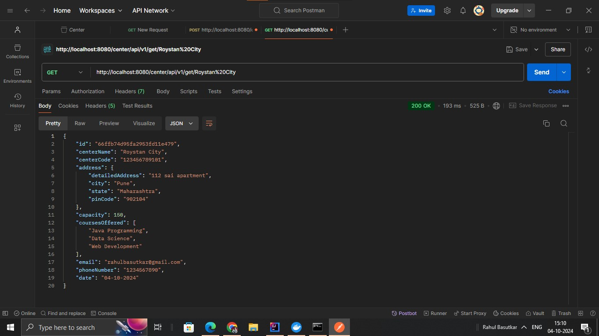

# Problem Statement

## Context
Traini8 is a startup focused on creating a registry of government-funded training centers. These centers offer various courses to help people acquire new skills. The goal is to create a registry that keeps track of the training centers, their details, and the courses they offer.

As a first step towards building this system, we need to develop a **Minimum Viable Product (MVP)** that will allow the government to register new training centers and retrieve information about them. The MVP should be scalable for future enhancements and be built using either **Spring Boot** or **Play Framework**.

## MVP Requirements

### Minimum Features
1. **Create Training Center**:
    - The system must allow the creation of a new training center by providing necessary details such as name, code, address, courses offered, capacity, and contact information.

2. **Get Training Centers**:
    - The system must provide an API to retrieve details of all registered training centers.

## Object-Oriented Modeling and Design (OOMD) & Analysis

### Domain Model

#### Center
- `centerName`: `String` – Name of the training center
- `centerCode`: `String` – Unique code for the center
- `address`: `Address` – Address of the center
- `capacity`: `int` – Capacity of the center
- `coursesOffered`: `List<String>` – Courses offered by the center
- `date`: `Date` – Date when the center was established
- `email`: `String` – Contact email of the center
- `phoneNumber`: `Long` – Contact phone number of the center

#### Address
- `detailsAddress`: `String` – Detailed address of the center
- `city`: `String` – City where the center is located
- `state`: `String` – State where the center is located
- `pincode`: `long` – PinCode of the center location

---

### Service Layer

#### TrainingCenterService (Interface)
- `Center createCenter(Center center)` – Method to create a new center
- `List
 getAllCenters()` – Method to get all training centers
- `Center getCenterByName(String name)` – Method to fetch a center by name

---

### DTO (Data Transfer Object)

#### CenterDTO
- `centerName`: `String` – Name of the training center
- `centerCode`: `String` – Unique code for the center
- `address`: `Address` – Address of the center
- `capacity`: `int` – Capacity of the center
- `coursesOffered`: `List<String>` – Courses offered by the center
- `date`: `Date` – Date when the center was established
- `email`: `String` – Contact email of the center
- `phoneNumber`: `Long` – Contact phone number of the center

---

### Repository

#### CenterRepository (Interface)
- Extends `MongoRepository<Center, String>` – Repository interface to interact with MongoDB for Center-related operations

---

### Controller

#### TrainingCenterController
- API for creating a new center
- API for fetching all centers
- API for fetching a center by name

---

### Exception Handling
- `GlobalExceptionHandler` – Handles exceptions globally and returns meaningful error messages for failed operations.

followings are the screen shot of api endpoint responses
1) To get all training centres

2) To Create Center with the given properties

3) Use Of Validation and global ExceptionHandler

4) TO get the center by its name

Data in MongoDb

